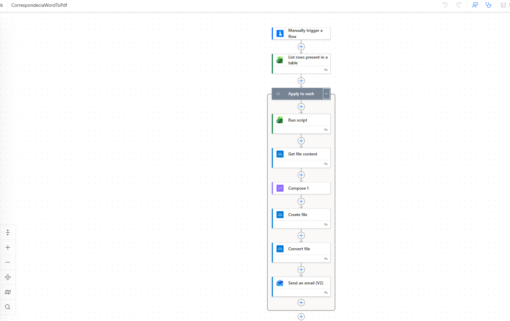

# Automatizaciones con Power Automate

## 1. Correspondencia Word/HTML a PDF personalizado

### ¿Qué hace?
Lee una tabla de Excel con información de empleados y genera automáticamente 
un documento PDF personalizado para cada persona, enviándolo por correo electrónico.

### Flujo del proceso
1. **Trigger manual** — Se ejecuta cuando se activa manualmente
2. **List rows** — Lee los registros de la tabla Excel
3. **Apply to each** — Itera sobre cada empleado
4. **Run script** — Personaliza el documento con los datos del empleado
5. **Get file content** — Obtiene el archivo generado
6. **Create file** — Crea el archivo en SharePoint/OneDrive
7. **Convert file** — Convierte el documento a PDF
8. **Send email** — Envía el PDF al correo del empleado

### Tecnologías usadas
- Power Automate
- Microsoft Excel (fuente de datos)
- SharePoint / OneDrive
- Office Scripts
- Outlook (envío de correos)

### Captura del flujo

